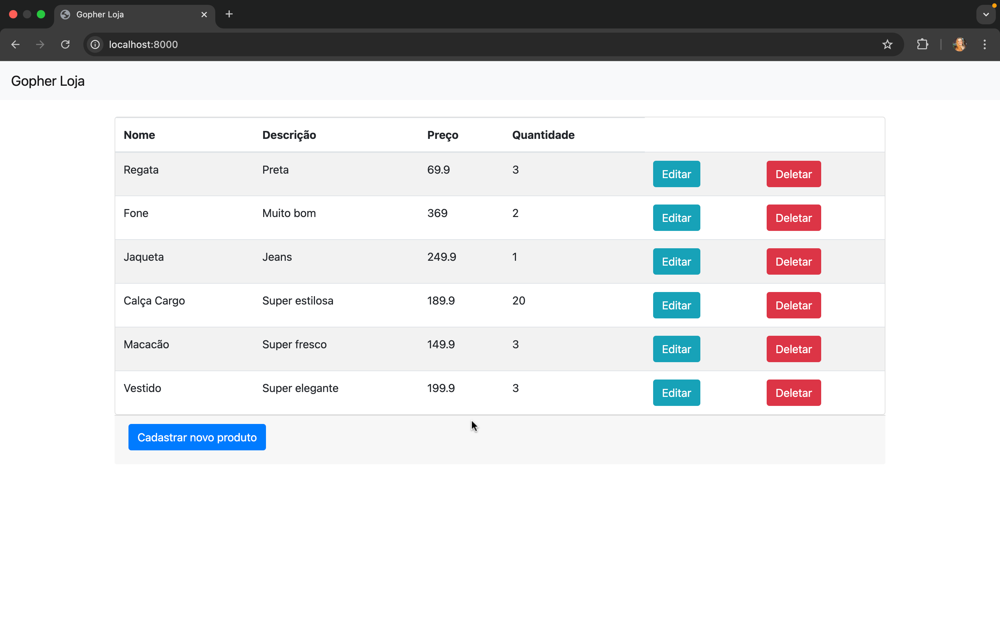
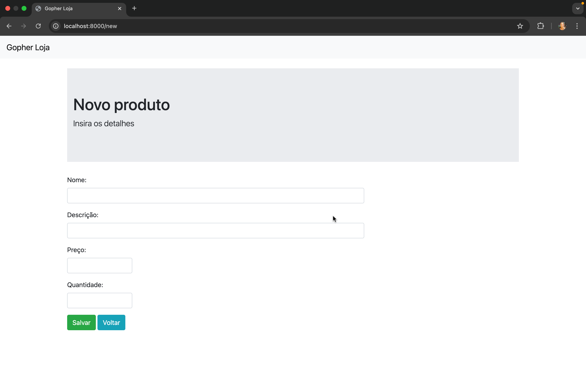
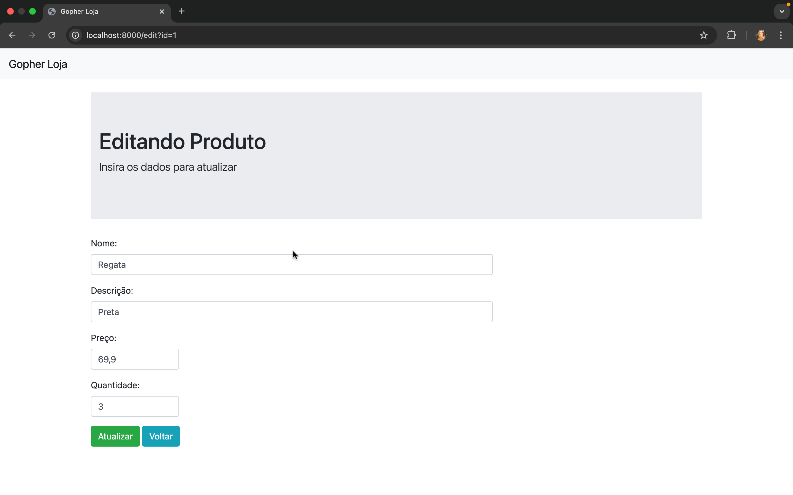

# Loja Gopher 

## Descrição 📋

Este é um projeto de aplicação web desenvolvido como parte do curso 'Go: Crie uma Aplicação Web' da Alura. O objetivo é criar uma loja online simples, onde é possível adicionar novos produtos ao banco de dados, visualizar os produtos cadastrados, além de permitir a alteração, atualização e exclusão dos produtos.

## Tecnologias Utilizadas 🛠️

- **Go**: Linguagem de programação principal.
- **PostgreSQL**: Banco de dados utilizado para armazenar os produtos.
- **Bootstrap**: Framework de CSS para estilização da interface.
- **HTML / CSS**: Estrutura e estilo da página.

## Estrutura do Projeto 🏗️

O projeto foi estruturado de acordo com o padrão MVC (Model-View-Controller) para uma maior organização e escalabilidade:

- **Model (Banco de Dados)**: Interação com o banco de dados para armazenar os produtos.
- **View (Templates)**: Renderização das páginas HTML, com a utilização de templates para as diferentes páginas (index, new, etc.).
- **Controller (Lógica de Negócio)**: Controla a comunicação entre os modelos (banco de dados) e as visualizações (páginas HTML).

## Instalação ⚙️

### Passo a Passo 📍

1. Clone o repositório para sua máquina:

    ```bash
    git clone https://github.com/seu-usuario/loja-gopher.git
    cd loja-gopher
    ```

2. Instale as dependências do Go:

    ```bash
    go mod tidy
    ```

3. Configure o banco de dados PostgreSQL:

    - Crie um banco de dados chamado `lojagopher` ou altere a string de conexão no arquivo `db/conexao.go` para corresponder ao seu banco.
    - Crie a tabela de produtos com o seguinte comando SQL:

    ```sql
    CREATE TABLE produtos (
        id SERIAL PRIMARY KEY,
        nome VARCHAR(100),
        descricao TEXT,
        preco DECIMAL(10, 2),
        quantidade INT
    );
    ```

4. Rodando a aplicação:

    Após configurar o banco de dados, você pode rodar o servidor com o seguinte comando:

    ```bash
    go run main.go
    ```

5. Acesse a aplicação no seu navegador:

    Abra o navegador e acesse `http://localhost:8000` para visualizar a aplicação. Você poderá visualizar os produtos cadastrados e adicionar novos produtos através da interface.

## Funcionalidades ⚡

- **Página inicial (Index)**: Lista todos os produtos cadastrados no banco de dados.
- **Página de criação de novo produto (New)**: Formulário para cadastrar novos produtos na loja.
- **Banco de Dados**: Produtos são armazenados no banco PostgreSQL com os campos `nome`, `descrição`, `preço` e `quantidade`.
- **Deletar Produto** 🗑️: O produto pode ser deletado da lista de produtos com uma confirmação antes da exclusão.
- **Atualizar Produto** ✏️: O produto pode ser atualizado, permitindo alterar dados como nome, descrição, preço e quantidade.

---

## Funcionalidades Detalhadas

### **Deletar Produto** 🗑️

- Quando o usuário deseja excluir um produto, um alerta de confirmação será exibido, garantindo que a exclusão seja intencional.
- Após a confirmação, o produto será removido do banco de dados.

### **Atualizar Produto** ✏️

- Na página de atualização, os dados atuais do produto são carregados, permitindo ao usuário editar os campos desejados.
- Após a edição, os dados são atualizados no banco de dados.

## Refatoração do Código 🔧

O código foi refatorado para garantir melhor organização e manutenção, utilizando **partials**. Permitindo que partes reutilizáveis da aplicação sejam centralizadas e simplificadas, facilitando futuras alterações ou adições de funcionalidades.

## Visualização 💻

Veja abaixo como está a interface da aplicação:

  
  
  
  

## Contato 📞

Se você tiver alguma dúvida ou sugestão, entre em contato comigo:

- **Nome:** Kamilly Ceppas 
- **GitHub:** [@kamillyceppas](https://github.com/kamillyceppas)
- **LinkedIn:** [Kamilly Ceppas](https://www.linkedin.com/in/kamillyceppas/)
